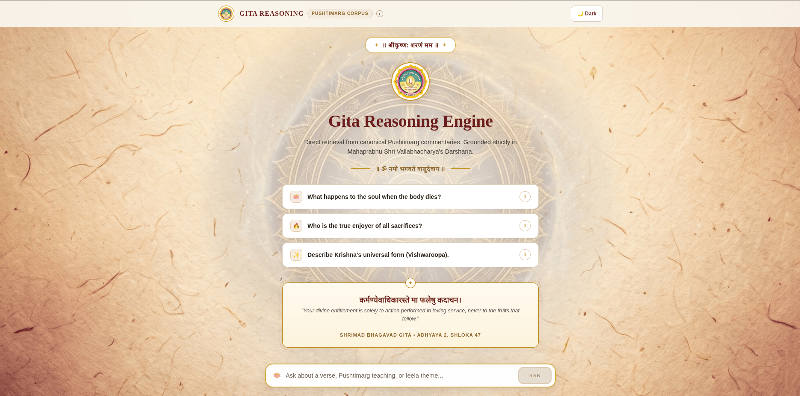
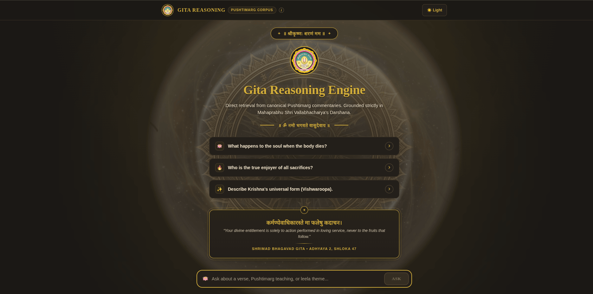
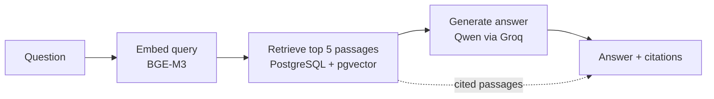

# Gita Reasoning Engine

A retrieval-grounded Q&A system for the Bhagavad Gita that answers **strictly from one
defined Pushtimarg source**: Sanskrit verses, their translations, and a Gujarati commentary
in the Vitthalnathji tradition. It does not draw on outside philosophy, and every answer
cites the chapter and verse it came from.

<p align="center">
  
  
</p>

## The problem

General-purpose language models blend traditions when asked about the Gita. A question
about the soul can come back with Advaita, Dvaita, and modern self-help mixed into one
answer, with no way to tell which claim came from where.

This project constrains the model to a single accepted corpus. Retrieval finds the relevant
passages, the model is instructed to answer only from them, and those passages are returned
alongside the answer so every claim can be checked. When the corpus has no direct answer,
the system says so instead of inventing one.

## How it works



A small LangGraph graph with three nodes:

1. **Embed.** The question is embedded with BAAI/bge-m3 via the Hugging Face Inference API.
2. **Retrieve.** pgvector cosine-distance search runs over both verse translations and
   commentary. The two candidate lists are merged and the overall top 5 are kept.
3. **Generate.** Passages are formatted into a prompt with chapter/verse labels, and
   `qwen/qwen3.8-27b` (hosted on Groq) answers using only that text.

The system prompt requires the model to: use only the provided passages; cite chapter and
verse for every specific claim; say so plainly when the passages don't address the question;
stay faithful to the tradition in the source text; and keep core terms — *dharma*, *atman*,
*karma* — in their original form rather than translating them into generic English.

Every question, what was retrieved, and what was generated is written to a query log, and
each pipeline stage logs its own latency so slow stages are easy to isolate.

Corpus vectors are generated in bulk on a Kaggle GPU and imported into Postgres. At query
time, only the single incoming question needs embedding.

The chat interface keeps the whole conversation on one page — new questions and answers
append below the previous ones rather than navigating to a separate view — and both the
conversation and the light/dark theme choice persist across a refresh.

## Design decisions

- **One source by design.** The system's value is faithfulness to a single tradition, so
  the corpus is deliberately narrow. Questions outside it get a "not found" style answer.
- **Truncate for the model, never for the user.** Commentary length varies widely — median
  ~71 words, longest over 1,300. Long rows are capped at 200 words for the prompt sent to
  the model, cut at the last sentence boundary; every truncation is logged with the original
  and kept word counts. The citations shown in the UI are always the full, untruncated text.
- **Retry once on truncated output.** If the model's own length limit cuts an answer short,
  the request retries once with a stricter brevity instruction — repeating the identical
  prompt would likely hit the same limit again.
- **Honest rate-limit behavior.** Generation runs on Groq's free tier, where one heavy
  request can consume much of the per-minute token budget. The client retries on HTTP 429
  with exponential backoff, honoring Groq's own `Retry-After` value when present; if retries
  are exhausted, the API returns a real `429` with a `Retry-After` header instead of a
  generic error. Queueing was deliberately left out as infrastructure this project doesn't
  otherwise need. A separate per-client rate limit (slowapi, by IP) applies on top.
- **Client-side conversation and theme persistence.** Chat history and the light/dark theme
  choice are saved to the browser's localStorage rather than a backend session store —
  enough to survive a refresh or a closed tab on the same device, with no added
  infrastructure. Deliberately not synced across devices; real multi-device history would
  need server-side accounts, which this project's scope doesn't call for.
- **Evidence over assumption on retrieval tuning.** Three retrieval-improvement ideas —
  cross-encoder reranking, an instruction prefix on the query embedding, and translating the
  query into the corpus's language — were each built, measured, and rejected based on
  results, not intuition. See Evaluation below.
- **Graph database deferred.** Neo4j is intentionally not part of the stack yet; the
  reasoning is recorded in an Architecture Decision Record in `docs/architecture/`.

## Evaluation

`src/gita_engine/evaluation/` measures the system at three levels:

- **Retrieval quality** (`evaluate_retrieval.py`): Hit Rate @ k and Mean Reciprocal Rank
  against a hand-curated 18-question golden set. No LLM involved.
- **Citation grounding** (`evaluate_faithfulness.py`): a deterministic check that every
  chapter.verse citation in a generated answer corresponds to a passage that was actually
  retrieved for that question. No model call, so no run-to-run variance.
- **Claim-level faithfulness** (`evaluate_faithfulness_llm_judge.py`): an LLM judge that
  splits an answer into individual claims and checks each against the retrieved text —
  catches cases where a real verse is cited but mischaracterized. Built by hand because the
  `ragas` package wouldn't run in this environment, which also means the judging prompt and
  the definition of "faithful" are fully owned rather than inherited from a library default.

**Baseline.** Plain embedding retrieval on the 18-question golden set: **Hit Rate@5 of
61.11% (11/18)**, **MRR of 0.556**.

Three follow-up experiments were run against this baseline:

| Experiment | Hit Rate@5 | MRR | Result |
|---|---|---|---|
| Baseline (embedding only) | 61.11% (11/18) | 0.556 | — |
| Cross-encoder reranking (`bge-reranker-v2-m3`, pool of 20 → top 5) | 44.44% (8/18) | 0.301 | **Rejected** — 7 baseline hits became misses, no misses fixed |
| Query instruction prefix on embedding | 44.44% (8/18) | 0.256 | **Rejected** — worse on both metrics |
| Query translation (English → Gujarati before embedding) | 61.11% (11/18) | 0.435 | **Rejected** — identical hits/misses to baseline, ranking only got worse |

The translation result is the most informative negative: it directly tests the theory that
the failures are a cross-lingual mismatch (English question vs. Gujarati/Sanskrit corpus).
Translating the query into Gujarati before embedding didn't rescue a single one of the 7
baseline misses — same exact questions failed either way — which rules that theory out
rather than leaving it as an assumption. The reranker and prefix experiments both point the
same direction: retrieval degrades when the query representation moves further from the raw
question, not closer to the corpus's surface form. The actual bottleneck looks like genuine
semantic distance between abstract, conversational questions and specific doctrinal verses —
a harder problem than a query-side trick can fix. The reranker code and the `--rerank` /
`--prefix` / `--translate` flags stay in `evaluate_retrieval.py` as a reproducible harness
for future experiments (e.g. a different embedding model) rather than being deleted.

A written record of each build phase is in `docs/phases/`.

## Tech stack

| Layer | Choice |
|---|---|
| Language / tooling | Python 3.12+, uv |
| API | FastAPI, Uvicorn, Pydantic |
| Rate limiting | slowapi |
| Database | PostgreSQL 17 with pgvector, SQLAlchemy, Alembic, psycopg |
| Embeddings | BAAI/bge-m3 (Hugging Face Inference API) |
| Orchestration | LangGraph |
| Generation | `qwen/qwen3.8-27b` on the Groq API, called with httpx |
| Logging | structlog |
| Ingestion (optional extra) | PyMuPDF, PaddleOCR |
| Frontend | Next.js, TypeScript, plain CSS (light and dark themes) |
| Infra | Docker Compose |

## Getting started

Prerequisites: Docker, Node.js, a Groq API key, and a Hugging Face access token.

```bash
# 1. Install Python dependencies
make install

# 2. Configure environment
cp .env.example .env
# Set at least: POSTGRES_PASSWORD, GROQ_API_KEY, HF_API_TOKEN

# 3. Start Postgres, API and frontend
make up

# 4. Apply database migrations
make migrate
```

- Frontend: http://localhost:3000
- API docs: http://localhost:8000/docs

To run the frontend outside Docker instead:

```bash
cd frontend
npm install
npm run dev
```

The corpus is not included in this repository. Loading it (including the one-time Kaggle
embedding round trip) is described in
`docs/phases/phase_5_6_7_retrieval_reasoning_evaluation.md`.

Useful commands: `make test`, `make lint`, `make typecheck`, `make logs`, `make down`.
Run `make help` for the full list.

### Configuration

| Variable | Purpose |
|---|---|
| `GROQ_API_KEY` | Required for answer generation |
| `HF_API_TOKEN` | Required for query embedding |
| `GENERATION_MODEL` | Generation model ID (default `qwen/qwen3.8-27b`) |
| `EMBEDDING_MODEL` | Embedding model (BGE-M3) |
| `POSTGRES_*` | Database connection settings |
| `CORS_ALLOWED_ORIGINS` | Origins allowed to call the API |

Never commit `.env`.

## API behavior

Interactive documentation is at `/docs`. Errors are mapped to meaningful statuses:

| Status | Meaning |
|---|---|
| `429` | Generation model rate-limited. `Retry-After` gives the wait in seconds. |
| `502` | The embedding model or the generation model is unavailable. |

## Project structure

```
src/gita_engine/     Core Python package (db, embedding, retrieval, reasoning,
                     generation, evaluation, api, core)
frontend/            Next.js chat UI
scripts/             Dev and verification scripts
tests/               Unit and integration tests
alembic/             Database migrations
data/                Corpus (gitignored, not committed)
docs/                Phase writeups and architecture decision records
docker/              Dockerfile and Compose stack for local dev
```

## Limitations and future work

**Current limitations**

- Definitional questions can miss. For a query like "What is dharma?", the top retrieved
  passages may not contain a direct definition, so the system reports the term isn't
  defined as a standalone concept.
- Some verses act as "attractors" in embedding search (e.g. 1.30, 16.14), scoring falsely
  high for unrelated questions.
- Retrieval accuracy on the golden set is modest — Hit Rate@5 of 61.11% — and three
  targeted fixes (reranking, a query prefix, query translation) have each been tried and
  ruled out. Improving it further is the main open problem, and likely needs a different
  embedding model or a larger/re-curated golden set rather than a query-side adjustment.
- Two users asking at nearly the same time on the free tier can trigger a `429`.
- Long commentary is trimmed in the prompt, which can occasionally drop a relevant
  conclusion.
- Conversation history is browser-local only (localStorage) — it doesn't sync across
  devices or browsers, and clearing site data removes it.

**Ideas for future work**

- Evaluate a different embedding model, since three query-side interventions (reranking,
  prefix, translation) have each failed to move retrieval accuracy
- Expand or re-curate the golden set to separate "direct verse lookup" questions from
  harder abstract/conversational ones, since the current failures cluster heavily in the
  latter category
- Server-side, cross-device conversation history (would need user accounts)
- Request queueing if usage grows beyond the free tier
- Publish evaluation results on a larger question set

## License

MIT (portfolio/personal project).