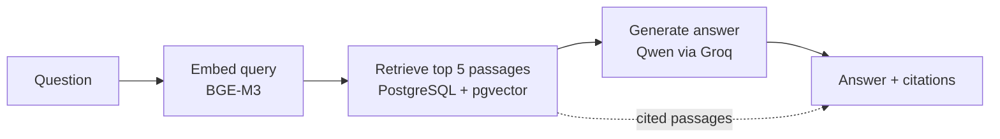

# Gita Reasoning Engine

A retrieval-grounded Q&A system for the Bhagavad Gita that answers **strictly from one
defined Pushtimarg source**: Sanskrit verses, their translations, and a Gujarati
commentary in the Vitthalnathji tradition. It does not bring in outside philosophy, and
every answer cites the chapter and verse it came from.

<!-- Add screenshots: docs/images/hero-light.png, docs/images/hero-dark.png -->

## The problem

General-purpose language models blend traditions when asked about the Gita. A question
about the soul can come back with Advaita, Dvaita and modern self-help mixed into one
answer, with no way to tell which claim came from where.

This project constrains the model to a single accepted corpus. Retrieval finds the
relevant passages, the model is instructed to answer only from them, and the passages are
returned alongside the answer so every claim can be checked. When the corpus has no direct
answer, the system says so instead of inventing one.

## How it works



The reasoning pipeline is a small LangGraph graph with three nodes:

1. **Embed.** The question is embedded with BAAI/bge-m3 through the Hugging Face
   Inference API.
2. **Retrieve.** pgvector cosine-distance search runs over both the verse translations and
   the commentary. The two candidate lists are merged and the overall top 5 are kept.
3. **Generate.** The passages are formatted into a prompt with chapter and verse labels, and
   `qwen/qwen3.8-27b` (hosted on Groq) answers using only that text.

The system prompt tells the model to use only the provided passages, cite chapter and verse
for every specific claim, say so plainly when the passages don't address the question, stay
faithful to the tradition in the passages, and keep core terms like *dharma*, *atman* and
*karma* in their original form instead of translating them into generic English.

Each question, what was retrieved, and what was generated is written to a query log. Every
stage also logs its own latency, so slow stages are easy to find.

The corpus vectors are generated in bulk on a Kaggle GPU and imported into Postgres. At query
time only the single question needs embedding.

## Design decisions

- **One source by design.** The value of the system is faithfulness to a single tradition,
  so the corpus is deliberately narrow. Questions outside it get a "not found" style answer.
- **Truncate for the model, never for the user.** Commentary rows vary widely in length: the
  median is about 71 words, but the longest is over 1,300 words. Long rows are capped at 200
  words, cut at the last sentence boundary, and only in the prompt sent to the model. The
  citations returned to the UI are the full passages. Every truncation is logged with the
  original and kept word counts.
- **Handling model output limits.** If an answer is cut off by the model's length limit, the
  request is retried once with a different instruction, since repeating the same prompt
  would likely produce the same length again.
- **Honest rate-limit behavior.** Generation runs on Groq's free tier, where one heavy
  request can use much of the per-minute token budget. The client retries on HTTP 429 with
  exponential backoff, using Groq's own retry-after value when present. If retries run out,
  the API returns a real `429` with a `Retry-After` header instead of a generic error.
  Queueing was rejected as extra infrastructure this project doesn't otherwise need. The API
  also applies its own per-client rate limit (slowapi, keyed by IP address).
- **Evidence over assumption on reranking.** A cross-encoder reranking step was built and
  measured, then deliberately left out of the pipeline (see Evaluation).
- **Graph database deferred.** Neo4j is intentionally not part of the stack yet. The reasoning
  is recorded in an Architecture Decision Record in `docs/architecture/`.

## Evaluation

The `src/gita_engine/evaluation/` package measures the system at three levels:

- **Retrieval quality** (`evaluate_retrieval.py`): Hit Rate @ k and Mean Reciprocal Rank
  against a hand-curated golden set of 18 questions, with no LLM involved.
- **Citation grounding** (`evaluate_faithfulness.py`): a deterministic check that every
  chapter.verse citation in a generated answer corresponds to a passage that was actually
  retrieved for that question. No second model call, so no run-to-run variance.
- **Claim-level faithfulness** (`evaluate_faithfulness_llm_judge.py`): an LLM judge that
  splits an answer into individual claims and checks each one against the real retrieved
  text. This catches cases where a real verse is cited but mischaracterized. It is built by
  hand, because the `ragas` package would not run in the project's environment, and building
  it directly means the judging prompt and the definition of "faithful" are fully owned.

**Baseline.** On the 18-question golden set, plain embedding retrieval reaches Hit Rate@5 of
61.11% (11 of 18) with an MRR of 0.556.

**Reranking experiment.** Widening retrieval to the top 20 and reranking down to 5 with
`BAAI/bge-reranker-v2-m3` lowered Hit Rate@5 to 44.44% (8 of 18) and MRR to 0.301. Seven
previously correct hits became misses and none of the known misses were fixed, so the
reranker is not used. It likely fits this corpus poorly because the queries are English while
the commentary is Gujarati and Sanskrit. The reranker code and the `--rerank` flag stay in
place as an A/B harness for future experiments with a different model.

A written record of each build phase is in `docs/phases/`.

## Tech stack

| Layer | Choice |
|---|---|
| Language / tooling | Python 3.12+, uv |
| API | FastAPI, Uvicorn, Pydantic |
| Rate limiting | slowapi |
| Database | PostgreSQL 17 with pgvector, SQLAlchemy, Alembic, psycopg |
| Embeddings | BAAI/bge-m3 (Hugging Face Inference API) |
| Orchestration | LangGraph |
| Generation | `qwen/qwen3.8-27b` on the Groq API, called with httpx |
| Logging | structlog |
| Ingestion (optional extra) | PyMuPDF, PaddleOCR |
| Frontend | Next.js, TypeScript, plain CSS (light and dark themes) |
| Infra | Docker Compose |

## Getting started

Prerequisites: Docker, Node.js, a Groq API key, and a Hugging Face access token.

```bash
# 1. Install Python dependencies
make install

# 2. Configure environment
cp .env.example .env
# Set at least: POSTGRES_PASSWORD, GROQ_API_KEY, HF_API_TOKEN

# 3. Start Postgres, API and frontend
make up

# 4. Apply database migrations
make migrate
```

- Frontend: http://localhost:3000
- API docs: http://localhost:8000/docs

To run the frontend outside Docker instead:

```bash
cd frontend
npm install
npm run dev
```

The corpus is not included in this repository. Loading it (including the one-time Kaggle
embedding round trip) is described in
`docs/phases/phase_5_6_7_retrieval_reasoning_evaluation.md`.

Useful commands: `make test`, `make lint`, `make typecheck`, `make logs`, `make down`.
Run `make help` for the full list.

### Configuration

| Variable | Purpose |
|---|---|
| `GROQ_API_KEY` | Required for answer generation |
| `HF_API_TOKEN` | Required for query embedding |
| `GENERATION_MODEL` | Generation model ID (default `qwen/qwen3.8-27b`) |
| `EMBEDDING_MODEL` | Embedding model (BGE-M3) |
| `POSTGRES_*` | Database connection settings |
| `CORS_ALLOWED_ORIGINS` | Origins allowed to call the API |

Never commit `.env`.

## API behavior

Interactive documentation is at `/docs`. Errors are mapped to meaningful statuses:

| Status | Meaning |
|---|---|
| `429` | Generation model rate-limited. `Retry-After` gives the wait in seconds. |
| `502` | The embedding model or the generation model is unavailable. |

## Project structure

```
src/gita_engine/     Core Python package (db, embedding, retrieval, reasoning,
                     generation, evaluation, api, core)
frontend/            Next.js chat UI
scripts/             Dev and verification scripts
tests/               Unit and integration tests
alembic/             Database migrations
data/                Corpus (gitignored, not committed)
docs/                Phase writeups and architecture decision records
docker/              Dockerfile and Compose stack for local dev
```

## Limitations and future work

**Current limitations**

- Definitional questions can miss. For a query like "What is dharma?", the top retrieved
  passages may not contain a direct definition, so the system reports that the term isn't
  defined as a standalone concept.
- Some verses act as "attractors" in embedding search (for example 1.30 and 16.14), scoring
  falsely high for unrelated questions. Retrieval accuracy on the golden set is modest
  (Hit Rate@5 of 61.11%), and improving it is the main open problem.
- Two users asking at nearly the same time on the free tier can trigger a `429`.
- Long commentary is trimmed in the prompt, which can occasionally drop a relevant conclusion.

**Ideas for future work**

- Try a different reranker model, or query rewriting, to improve retrieval on definitional
  questions (the current reranker made results worse on this corpus)
- Conversation history in the UI
- Request queueing if usage grows beyond the free tier
- Publish evaluation results on a larger question set

## License

MIT (portfolio/personal project).